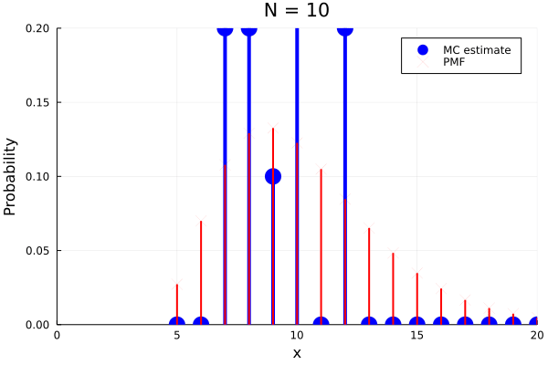

# Statistics with Julia From the Ground Up - 2022

This is a workshop prepared for [JuliaCon2022](https://juliacon.org/2022/). See the [abstract](https://live.juliacon.org/talk/F7WDXE). The actual workshop in JuliaCon is in Hebrew (עברית). The 2021 JuliaCon had a somewhat similar workshop in English, with code in [this repo](https://github.com/yoninazarathy/JuliaCon2021-StatisticsWithJuliaFromTheGroundUp) and a YouTube video available [here](https://www.youtube.com/watch?v=IlPoU5Yr2QI).



In order to run the workshop make sure that you have Julia executable installed (it was tested under Julia 1.6.0 and 1.6.2).

One way to run the workshop is to run as follows (you may also view the [installation video](https://youtu.be/KJleqSITuRo)):
1. Clone this [workshop repository](https://github.com/yoninazarathy/JuliaCon2021-StatisticsWithJuliaFromTheGroundUp) to a local folder on your computer (or download the zip file).
2. Start Julia.
3. If you don't have IJulia installed install it via (`]` puts you in package manager mode):
```
] 
add IJulia
```
Now hit backspace to exit the package manager.

4. Start Jupyter Notebook with:
```
using IJulia
notebook()
```
The first time you run `notebook` you may be asked if to install `Conda`. Recommended to hit `y`.

5. In the Jupyter envionrment that opens in your web browser, navigate to the correct folder which you downloaded, open the *Workshop.ipynb* file, and run the first few cells up to the section `Why Julia?`. These cells will install the needed packages in the enviornment for the workshop. This will take considerable time but only needs to be run once. Note the line with `using RCall` is commented out. If you have R installed on your system you may uncomment it (delete `#uncomment if using R: `). 

You can also consider:
- A version of the repository with [all output](https://github.com/yoninazarathy/JuliaCon2021-StatisticsWithJuliaFromTheGroundUp/blob/master/Workshop-with-output.ipynb) or look at it in [nbviewer](https://nbviewer.jupyter.org/github/yoninazarathy/JuliaCon2021-StatisticsWithJuliaFromTheGroundUp/blob/master/Workshop-with-output.ipynb#home).


Some key links:
* [JuliCon 2022](https://juliacon.org/2022/)
* [Statistics with Julia: Fundamentals for Data Science, Machine Learning and Artificial Intelligence](https://statisticswithjulia.org/)
